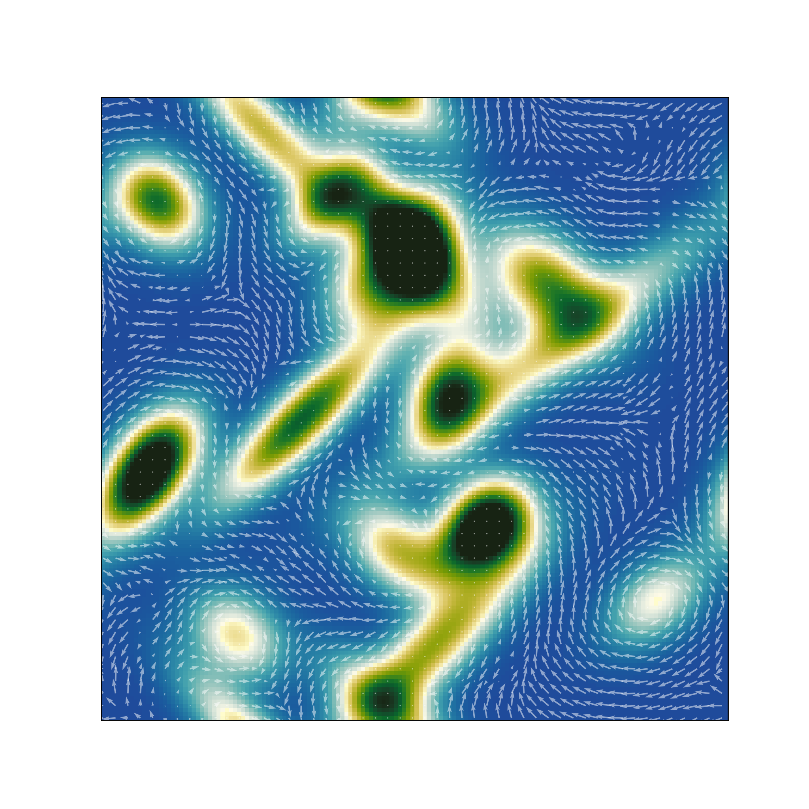

# SubWorld Dynamic Programming

This repository conatins the code required to create SubWorld:
- Charts
- Water currents
- Value functions
- Policies

## Generating Charts

Running **gen_land.py** will generate a single chart with water currents stored in **data/charts/charts_SEED.npz**. Running **gen_land_many.py** will generate many charts with water currents stored in **data/charts/charts_SEED.npz**. These charts are generated in parallel using _multiprocessing_.

The charts and water currents can be visualized using **plot_chart.py**.

## Generating Value Functions

Running **chart_value.py** will generate the value function assuming the chart has no water currents. The value function is generated using Bellman's dynamic programming algorithm and will be stored in **data/value/value_SEED.npz**. Running **chart_value_many.py** will generate the value functions for each chart from **gen_land_many.py** stored in **data/value/value_SEED.npz**.

The value functions can be visualized using **plot_value.py**.

## Generating Policies

Running **chart_policy_gps.py** will generate a policy based on the value function. The policy's trajectectory will be stored in **data/policy/policy_GPS_SEED.npz**.

The policy trajectories can be visualized using **plot_policy.py**.

## YAML Parameters

The parameters used in each task are stored in **params.yaml**. Some parameters may carry forward into other tasks.

### Generating Charts

|Parameter   |Description |
|------------|------------|
|seed        |The random seed used create the islands that define the chart. |
|dim         |The dimension size of the chart.
|n_islands   |The number of islands that will be generated. Setting **None** will result in a random number of islands. |
|max_islands |The maximum number of islands that will be generated if **n_islands** is **None**. |
|size        |The size of the x and y dimensions of the chart. The Submarine can move up to 1 unit per action. |
|min_height  |The minimum height of each island. |
|max_height  |The maximum height of each island. |
|x_decay_min |The minimum decay rate in the x direction of each island. |
|x_decay_max |The maximum decay rate in the x direction of each island. |
|y_decay_min |The minimum decay rate in the y direction of each island. |
|y_decay_max |The maximum decay rate in the y direction of each island. |
|max_cur     |The maximum water current magnitude. |

### Value Function Generation

|Parameter   |Description |
|------------|------------|
|target_x    |The x coordinate of the target. |
|target_y    |The y coordinate of the target. |
|discount    |The discount factor used in Bellman's dynamic programming algorithm. |
|n_t         |The number of discretized throttle actions. |
|n_h         |The number of discritized heading actions. |
|tol         |Log base 10 of the convergence tolerence used in Bellman's dynamic programming algorithm. I.e. tol=-6 -> a tolerence of 1e-6.|

### Extra Paramters for Parallelization

|Parameter   |Description |
|------------|------------|
|n_cpu       |The number of CPUs used in **multiprocessing.Pool** when generating many charts/value functions. |
|maps_i      |The seed to start at when generating many charts. |
|maps_f      |The seed to end at when generating many charts.

### Policy Generation

|Parameter   |Description |
|------------|------------|
|sub_x       |The x coordinate for the submarine's starting position. Setting **None** will result in a random coordinate. |
|sub_y       |The y coordinate for the submarine's starting position. Setting **None** will result in a random coordinate. |
|n_steps     |The maximum number of steps the agent can take before the episode ending. |
|gps_cost    |The cost required to use the GPS. If set to zero, the GPS will be used at every step. If set 2.0, the GPS will never be used. |
|uncert_i    |The uncertainty in water current/position after the GPS is used. |
|uncert_inc  |The rate the uncertainty increases after each step the GPS is not used. |
